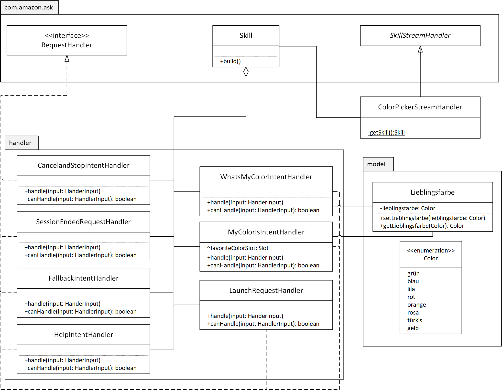

# Demoprojekt skillproject-test: Lieblingsfarbe

Ein Beispiel Skill basierend auf [Github: https://github.com/alexa/alexa-skills-kit-sdk-for-java/tree/2.0.x/samples/colorpicker](https://github.com/alexa/alexa-skills-kit-sdk-for-java/tree/2.0.x/samples/colorpicker)

## Status

Der Skill wurde auf Deutsch übersetzt, es wurden Tests hinzugefügt und eine eigene Model-Klasse implementiert. 

Beta Test für Lieblingsfarbe (Invite Link): https://skills-store.amazon.com/deeplink/tvt/9570ef26f2c35d3fdb861ee5545445e914d325ffddd795d57f9f67ba23bd26207c1017659930590f3f4aa3aa20604f3d02c0869c213366e398f5b4b9586c0114f6cd89156cb7ade6d0bd7491d7d91c877d16792c18397528c591cee3272c91198c1cfd149060b7f35c55f49f2b024e

## Systemarchitektur

## Anwendungsfalldiagramm

## Klassendiagramm des AWS Lambda Funktion

## Aktivitätsdiagramm Lieblingsfarbe eingeben

## Sonstiges
Was ich gelernt habe: viel!
